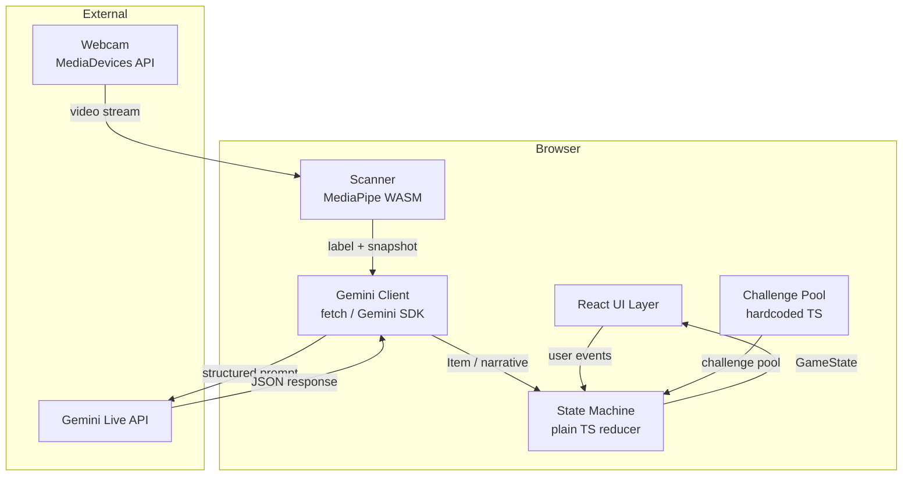
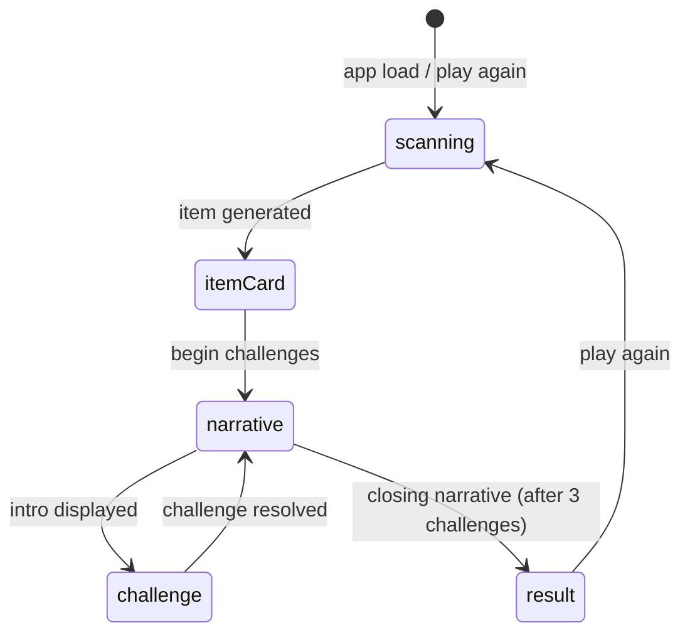

# Design Document — The Wrong Room

## Overview

"The Wrong Room" is a single-page, client-side browser game built with **Vite + React + TypeScript**. A player scans a real-world object via webcam; MediaPipe detects it in-browser, Gemini Live API transforms it into a legendary artifact, and the player uses that artifact to face three sequential text-based dungeon challenges narrated by Gemini as the Dungeon Master.

The entire game runs in the browser with no backend. The only external service is the Gemini Live API, called directly from the client using an API key stored in an environment variable. MediaPipe runs as a WASM module in-browser.

**Why Vite + React over Next.js:** This is a pure client-side app — no SSR, no API routes, no server components. Vite has zero framework overhead for client-only code, MediaPipe WASM loads without any special config, and the dev server HMR is significantly faster. Deployment is a static build (`vite build`) dropped on Vercel or Netlify.

### Key Design Decisions

- **No backend** — keeps deployment trivial for a hackathon; Gemini API key is exposed client-side (acceptable for a demo/hackathon context).
- **Plain TS state machine** — avoids Redux/Zustand overhead; the game state is simple enough that a reducer + React context is sufficient.
- **Structured JSON output from Gemini** — all Gemini calls that produce structured data use `response_mime_type: "application/json"` with a JSON schema to avoid brittle parsing.
- **MediaPipe ObjectDetector (WASM)** — runs entirely in-browser, no server round-trip for detection.
- **10-second scan-to-card SLA** — achieved by parallelizing MediaPipe detection (continuous) with a single Gemini call on confirm; the Gemini call is the only blocking step.
- **Tailwind CSS** — utility-first styling for the dark fantasy dungeon aesthetic; no custom CSS files needed.
- **Framer Motion** — declarative phase transition animations (fade/slide between scanning, itemCard, challenge, narrative, result phases) for demo polish.
- **Typewriter effect** — narrative text renders character-by-character via a `useTypewriter` hook, making Gemini's story output feel dramatic rather than instant.
- **Pre-generation optimization** — the story intro narrative is fired immediately after `ITEM_GENERATED` (while the player reads the item card), hiding Gemini latency before the first challenge.

---

## Architecture



### Phase Flow



---

## Components and Interfaces

### React Component Tree

```
<GameProvider>          — React context holding GameState + dispatch
  <App>
    <ScanningPhase>     — webcam feed, MediaPipe overlay, confirm button
      <VideoFeed>       — <video> element + canvas overlay
      <DetectionOverlay>— bounding box + label rendering on canvas
      <ConfirmButton>   — triggers item generation
    <ItemCardPhase>     — item reveal screen
      <ItemCard>        — name, flavor text, superpower, mechanic tag badge
      <BeginButton>     — transitions to narrative (intro)
    <NarrativePhase>    — story text display
      <NarrativeText>   — styled narrative paragraph(s)
      <ContinueButton>  — advances to next challenge or result
    <ChallengePhase>    — challenge scenario + use item
      <ChallengeCard>   — scenario text
      <ItemSummary>     — compact item card (name + mechanic tag)
      <UseItemButton>   — triggers Dungeon Master narration
    <ResultPhase>       — win/loss screen
      <OutcomeDisplay>  — win or loss message + closing narrative
      <PlayAgainButton> — resets state
```

### Key Interfaces

```typescript
// Scanner → Gemini Client
interface ScanResult {
  label: string;          // MediaPipe detected label
  imageBase64: string;    // base64-encoded JPEG snapshot
  confidence: number;
}

// Gemini Client public API
interface GeminiClient {
  generateItem(scan: ScanResult): Promise<Item>;
  generateIntroNarrative(item: Item): Promise<string>;
  generateBridgeNarrative(
    item: Item,
    completedChallenge: Challenge,
    outcome: boolean,
    history: string[]
  ): Promise<string>;
  generateClosingNarrative(
    item: Item,
    outcomes: boolean[],
    history: string[]
  ): Promise<string>;
  generateChallengeNarration(
    item: Item,
    challenge: Challenge,
    success: boolean
  ): Promise<string>;
}

// State machine
type Action =
  | { type: "ITEM_GENERATED"; item: Item }
  | { type: "BEGIN_CHALLENGES" }
  | { type: "NARRATIVE_READY"; text: string }
  | { type: "USE_ITEM" }
  | { type: "CHALLENGE_NARRATED"; narrative: string; success: boolean }
  | { type: "CONTINUE" }
  | { type: "PLAY_AGAIN" };
```

---

## Data Models

```typescript
type MechanicTag =
  | "slippery" | "fire" | "shield" | "electric"
  | "heavy" | "sharp" | "sticky" | "cold";

interface Item {
  name: string;
  flavorText: string;
  superpowerDescription: string;
  mechanicTag: MechanicTag;
}

interface Challenge {
  id: string;
  title: string;
  scenario: string;
  solvableTags: MechanicTag[];
}

type Phase = "scanning" | "itemCard" | "challenge" | "narrative" | "result";

interface GameState {
  currentPhase: Phase;
  currentItem: Item | null;
  selectedChallenges: Challenge[];   // 3 randomly selected, set at run start
  challengeIndex: number;            // 0–2
  challengeOutcomes: boolean[];      // parallel to selectedChallenges
  narrativeHistory: string[];        // ordered narrative segments this run
  pendingNarrativeTarget: "challenge" | "result" | null;
  error: string | null;
}

const INITIAL_STATE: GameState = {
  currentPhase: "scanning",
  currentItem: null,
  selectedChallenges: [],
  challengeIndex: 0,
  challengeOutcomes: [],
  narrativeHistory: [],
  pendingNarrativeTarget: null,
  error: null,
};
```

### Gemini JSON Schemas

**Item schema** (used with `response_mime_type: "application/json"`):
```json
{
  "type": "object",
  "properties": {
    "name":                  { "type": "string" },
    "flavorText":            { "type": "string" },
    "superpowerDescription": { "type": "string" },
    "mechanicTag":           { "type": "string", "enum": ["slippery","fire","shield","electric","heavy","sharp","sticky","cold"] }
  },
  "required": ["name","flavorText","superpowerDescription","mechanicTag"]
}
```

**Challenge narration schema**:
```json
{
  "type": "object",
  "properties": {
    "narrative": { "type": "string" }
  },
  "required": ["narrative"]
}
```

---

## Gemini Prompt Templates

### 1. Item Generation

```
System: You are a creative dungeon master for a text game set in a cursed version of a software company office. Your tone is absurdist comedy mixed with dark fantasy and AI humor.

User: The player is holding a {label}. Here is an image of it. [IMAGE]

Generate a legendary artifact based on this object. The artifact's superpower must be grounded in the object's real-world properties (e.g. a banana is slippery → "slippery" tag).

Return JSON matching this schema: { name, flavorText, superpowerDescription, mechanicTag }
mechanicTag must be exactly one of: slippery, fire, shield, electric, heavy, sharp, sticky, cold
```

### 2. Story Introduction

```
System: You are the Dungeon Master of the Software Mansion dungeon. Tone: absurdist comedy, dark fantasy, AI humor. Setting: a cursed version of a software company office in Kraków during a hackathon.

User: The player has obtained the "{item.name}" — {item.superpowerDescription}.

Write a story introduction of 10–15 sentences that:
- Sets the scene (player opened the wrong door, now in the dungeon)
- Introduces the item as a legendary artifact
- Hints at the dangers ahead
- Maintains the absurdist office-dungeon tone
```

### 3. Narrative Bridge

```
System: [same as above]

User: Story so far:
{narrativeHistory.join("\n\n")}

The player just faced: "{challenge.title}"
Outcome: {success ? "SUCCESS" : "FAILURE"}
Their item: "{item.name}" ({item.mechanicTag})

Write a narrative bridge of 5–10 sentences connecting this outcome to the next challenge.
```

### 4. Closing Narrative

```
System: [same as above]

User: Story so far:
{narrativeHistory.join("\n\n")}

The player completed all 3 challenges.
Item: "{item.name}"
Challenges solved: {outcomes.filter(Boolean).length} / 3
Overall result: {win ? "VICTORY" : "DEFEAT"}

Write a closing narrative of 10–15 sentences.
- VICTORY: player escapes back to the hackathon floor
- DEFEAT: player is permanently assigned to the dungeon's sprint planning
```

### 5. Challenge Narration

```
System: [same as above]

User: The player used "{item.name}" (mechanic: {item.mechanicTag}) against "{challenge.title}".
This challenge can be solved by: {challenge.solvableTags.join(", ")}.
Result: {success ? "SUCCESS — the item's power works" : "FAILURE — the item's power doesn't work"}.

Write a short narrative (3–5 sentences) describing what happens. Be creative and funny.
Return JSON: { "narrative": "..." }
```

### Token Budget

All narrative prompts cap `narrativeHistory` at 1500 tokens. Implementation truncates from the oldest segment, always preserving the most recent segment and the item description.

---

## State Machine Design

```typescript
function gameReducer(state: GameState, action: Action): GameState {
  switch (action.type) {
    case "ITEM_GENERATED":
      return { ...state, currentPhase: "itemCard", currentItem: action.item };

    case "BEGIN_CHALLENGES": {
      const selected = selectChallenges(CHALLENGE_POOL);
      return {
        ...state,
        currentPhase: "narrative",
        selectedChallenges: selected,
        pendingNarrativeTarget: "challenge",
      };
    }

    case "NARRATIVE_READY":
      return {
        ...state,
        narrativeHistory: [...state.narrativeHistory, action.text],
      };

    case "CONTINUE":
      if (state.pendingNarrativeTarget === "challenge") {
        return { ...state, currentPhase: "challenge" };
      }
      return { ...state, currentPhase: "result" };

    case "CHALLENGE_NARRATED": {
      const outcomes = [...state.challengeOutcomes, action.success];
      const nextIndex = state.challengeIndex + 1;
      const isLast = nextIndex >= 3;
      return {
        ...state,
        challengeOutcomes: outcomes,
        challengeIndex: nextIndex,
        currentPhase: "narrative",
        pendingNarrativeTarget: isLast ? "result" : "challenge",
        narrativeHistory: [...state.narrativeHistory, action.narrative],
      };
    }

    case "PLAY_AGAIN":
      return { ...INITIAL_STATE };

    default:
      return state;
  }
}
```

---

## MediaPipe Integration

### Setup

```typescript
// lib/detector.ts
import { ObjectDetector, FilesetResolver } from "@mediapipe/tasks-vision";

export async function initDetector(): Promise<ObjectDetector> {
  const vision = await FilesetResolver.forVisionTasks(
    "https://cdn.jsdelivr.net/npm/@mediapipe/tasks-vision/wasm"
  );
  return ObjectDetector.createFromOptions(vision, {
    baseOptions: {
      modelAssetPath:
        "https://storage.googleapis.com/mediapipe-models/object_detector/efficientdet_lite0/float16/1/efficientdet_lite0.tflite",
      delegate: "GPU",
    },
    scoreThreshold: 0.6,
    runningMode: "VIDEO",
  });
}
```

### Snapshot Capture

```typescript
function captureSnapshot(video: HTMLVideoElement): string {
  const canvas = document.createElement("canvas");
  canvas.width = video.videoWidth;
  canvas.height = video.videoHeight;
  canvas.getContext("2d")!.drawImage(video, 0, 0);
  return canvas.toDataURL("image/jpeg", 0.85).split(",")[1];
}
```

---

## File / Folder Structure

```
index.html
vite.config.ts
src/
  main.tsx
  App.tsx
  components/
    phases/
      ScanningPhase.tsx
      ItemCardPhase.tsx
      NarrativePhase.tsx
      ChallengePhase.tsx
      ResultPhase.tsx
    ui/
      ItemCard.tsx
      NarrativeText.tsx        — renders text via useTypewriter hook
      MechanicTagBadge.tsx
  hooks/
    useTypewriter.ts           — character-by-character text reveal hook
  lib/
    stateMachine.ts
    geminiClient.ts
    detector.ts
    challenges.ts
    tokenBudget.ts
  context/
    GameContext.tsx
  types/
    game.ts
  stretch/
    typegpu/
      ItemCardEffect.tsx
    smelter/
      VideoCompositor.tsx
    fishjam/
      MultiplayerSync.tsx
```

---

## Animation Strategy (Framer Motion)

```typescript
// App.tsx — phase router with Framer Motion transitions
<AnimatePresence mode="wait">
  <motion.div
    key={currentPhase}
    initial={{ opacity: 0, y: 24 }}
    animate={{ opacity: 1, y: 0 }}
    exit={{ opacity: 0, y: -24 }}
    transition={{ duration: 0.35, ease: "easeInOut" }}
  >
    {renderPhase(currentPhase)}
  </motion.div>
</AnimatePresence>
```

The item card reveal uses a scale-up from 0.8 + fade-in entrance animation.

---

## Typewriter Hook

```typescript
// hooks/useTypewriter.ts
export function useTypewriter(text: string, speed = 28): string {
  const [displayed, setDisplayed] = useState("");
  useEffect(() => {
    setDisplayed("");
    if (!text) return;
    let i = 0;
    const interval = setInterval(() => {
      setDisplayed(text.slice(0, ++i));
      if (i >= text.length) clearInterval(interval);
    }, speed);
    return () => clearInterval(interval);
  }, [text, speed]);
  return displayed;
}
```

Speed of 28ms/char gives ~35 chars/sec.

---

## Pre-Generation Optimization

```typescript
// ItemCardPhase.tsx
useEffect(() => {
  geminiClient.generateIntroNarrative(currentItem).then((text) => {
    dispatch({ type: "NARRATIVE_READY", text });
  });
}, [currentItem]);
```

The intro narrative fires in the background while the player reads the item card. `NarrativePhase` checks if `narrativeHistory[0]` already exists — if so, renders immediately with no loading state.

---

## Stretch Goal Integration Points

### TypeGPU — WebGL Item Card Effects (Req 13)

`ItemCard.tsx` accepts an optional `useWebGPU?: boolean` prop. When true and `navigator.gpu` is available, mounts `ItemCardEffect` which draws a glowing animated border shader and 2-second particle burst via TypeGPU. Falls back to plain HTML border if WebGPU is unavailable. Enabled via `VITE_ENABLE_TYPEGPU=true`.

### Smelter — Video Compositor Overlay (Req 11)

`ScanningPhase.tsx` checks `VITE_ENABLE_SMELTER=true`. When enabled, `VideoCompositor` composites the item card overlay onto the webcam stream via Smelter's compositor API.

### Fishjam — WebRTC Multiplayer (Req 12)

`useMultiplayer()` hook enabled via `VITE_ENABLE_FISHJAM=true`. Establishes a Fishjam room, broadcasts `Item` data on `ITEM_GENERATED`, renders peer item cards in `ChallengePhase`.

All three stretch integrations are opt-in via env flags with zero impact on the core game loop when disabled.

---

## Correctness Properties

### Property 1: Detection overlay label threshold
*For any* detection result, if confidence ≥ 0.6 the label is shown; if < 0.6 no label is shown.
**Validates: Requirements 2.2**

### Property 2: Scannable object classification
`isScannableItem` returns `true` for portable everyday objects and `false` for non-items. Consistent — same input always returns same result.
**Validates: Requirements 2.5**

### Property 3: Item generation request payload completeness
`generateItem` payload always contains both image data and object label. Neither may be absent or empty.
**Validates: Requirements 3.1, 3.2**

### Property 4: Item JSON round-trip
Serializing an `Item` to JSON and parsing it back produces a deeply equal object.
**Validates: Requirements 3.3, 3.6**

### Property 5: mechanicTag is always in the allowed set
Any `Item` from a parsed Gemini response has `mechanicTag` in the 8 allowed values. Others are rejected.
**Validates: Requirements 3.5**

### Property 6: Exactly 3 challenges selected per run
`selectChallenges(CHALLENGE_POOL)` always returns an array of length 3.
**Validates: Requirements 5.1, 9.2**

### Property 7: Each challenge has at least one solvable tag
Every `Challenge` in `CHALLENGE_POOL` has `solvableTags.length >= 1`.
**Validates: Requirements 5.3**

### Property 8: challengeIndex advances monotonically
After N `CHALLENGE_NARRATED` actions, `challengeIndex === N`. Never exceeds 3.
**Validates: Requirements 5.5**

### Property 9: Challenge outcome matches tag compatibility
`success` is `true` if and only if `challenge.solvableTags.includes(item.mechanicTag)`. Holds for all 64 combinations.
**Validates: Requirements 6.2, 6.3**

### Property 10: All 3 challenges always presented
State machine always advances through all 3 challenge slots before reaching result phase.
**Validates: Requirements 6.6**

### Property 11: Result phase reached after exactly 3 resolutions
After exactly 3 `CHALLENGE_NARRATED` + `CONTINUE`, `currentPhase === "result"`. Not reachable with fewer.
**Validates: Requirements 7.1**

### Property 12: Win/loss determination based on outcome count
Win state shown if and only if `outcomes.filter(Boolean).length >= 2`. All 8 combinations covered.
**Validates: Requirements 7.2, 7.3**

### Property 13: Challenge selection produces non-repeating challenges
All 3 selected challenges have distinct `id` values.
**Validates: Requirements 9.2**

### Property 14: Narrative prompt includes all required context
Every narrative call payload contains item name, superpower description, narrativeHistory, and resolved challenge outcomes.
**Validates: Requirements 10.7**

### Property 15: narrativeHistory token budget enforced
`truncateToTokenBudget` returns history with estimated token count ≤ 1500, always preserving most recent segment and item description.
**Validates: Requirements 10.10**

---

## Error Handling

| Scenario | Handling |
|---|---|
| `getUserMedia` denied | Error UI with reload instruction |
| MediaPipe WASM load failure | Error UI, suggest refresh |
| Item generation fails (1st attempt) | Retry once automatically |
| Item generation fails (2nd attempt) | Fallback error, return to scanning |
| Challenge narration fails | Generic fallback narrative; resolve by tag match |
| Narrative generation fails | Skip silently; advance to next phase |
| Malformed JSON response | Treat as API error; retry/fallback |
| mechanicTag not in allowed set | Reject; treat as malformed; retry |
| No detection for 10 seconds | Show "hold up an object" prompt |
| Non-scannable object detected | Show "hold up a physical object" message |

All async operations wrapped in try/catch. `GameState.error` cleared on phase transition. No error path permanently blocks the player.

---

## Testing Strategy

Use **fast-check** for property-based tests (TypeScript-native, works with Vitest):

```bash
npm install --save-dev fast-check
```

Tag format: `Feature: hackathon-object-game, Property {N}: {property_text}`

Minimum iterations: 100 default, 500 for critical properties (round-trip, state machine invariants, mechanicTag validation).

Performance: validate 10-second scan-to-item-card SLA manually in browser DevTools. Target Gemini response < 8 seconds.
